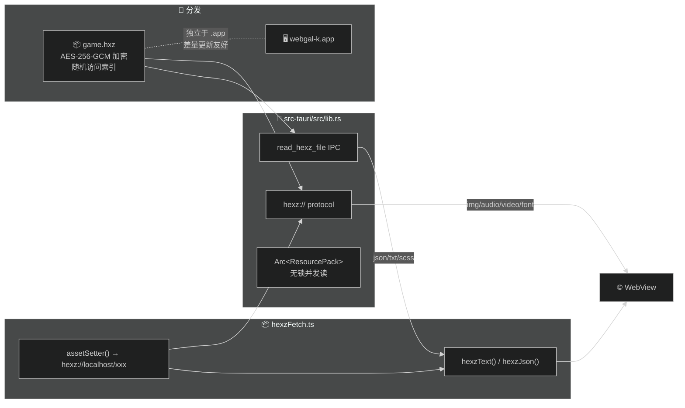

# WebGAL_k

**[English](./README_EN.md)**

> WebGAL + hexz = 加密 · 随机访问 · 差量更新的桌面端视觉小说引擎

基于 [WebGAL](https://github.com/OpenWebGAL/WebGAL) / [Tauri v2](https://v2.tauri.app) / [hexz](https://github.com/maincoretech/hexz_k)，将游戏资源打包为独立 `.hxz` 加密归档文件，支持 Steamworks 差量更新。

---

## 技术栈

| 层 | 技术 |
|----|------|
| 引擎 | **React 18** · **PIXI.js 7.4** · **TypeScript 5.9** |
| 原生 | **Tauri v2** (Rust) · WKWebView (macOS) / WebView2 (Windows) |
| 加密归档 | **hexz 0.8** — AES-256-GCM · O(1) 随机访问 · 无锁并发读 |
| 构建 | **Bun** · Vite 5 · Sass |
| 字体 | MavenPro (拉丁) + 花園明朝A 子集 (CJK + 假名, 4.6MB) |

### 依赖精简

移除了以下重型依赖，用原生 API 或轻量实现替代：

| 移除 | 替代 |
|------|------|
| lodash | `src/Core/util/lite.ts` — `cloneDeep` → `structuredClone`, 自实现 `omitBy`/`pickBy`/`throttle`/`isEqual` |
| localforage | Tauri `LazyStore` (自动保存, 100ms 防抖) |
| mitt | 移除，改直调 |
| axios | 移除，改 Tauri IPC / `hexz://` protocol |
| cloudlogjs | 移除，改 `src/Core/util/logger.ts` |

### Tauri 集成

| 插件 | 用途 |
|------|------|
| `plugin-store` | 玩家存档 / 设置持久化 |
| `plugin-fs` | 原生文件导入导出 |
| `plugin-dialog` | 原生文件选择对话框 |
| `plugin-process` | 进程管理 |
| `plugin-single-instance` | 防止多开 |
| `plugin-opener` | 在系统浏览器打开外部链接（WKWebView 阻止 `target="_blank"`) |

---

## 架构



**双通道设计** — `hexz://` protocol 处理 no-cors 媒体，Tauri IPC 处理文本资源（WKWebView 阻止跨域 XHR）。

| 资源类型 | 通道 | 原因 |
|----------|------|------|
| 图片 / 音频 / 视频 / 字体 | `hexz://` protocol | 浏览器原生，零开销 |
| json / txt / scss | Tauri IPC | WKWebView CORS 限制 |

---

## 与上游 WebGAL 差异

### 资源加载

| 上游 WebGAL | WebGAL_k |
|-------------|----------|
| 资源散落在 `public/game/` 目录 | 打包为单个 `game.hxz` 加密归档 |
| 通过相对路径 `./game/xxx` 加载 | 通过 `hexz://localhost/xxx` 协议加载 |
| 所有请求走浏览器 fetch/XHR | 双通道：no-cors 走 protocol，文本走 IPC |
| 依赖 Service Worker 做缓存/转发 | 无 SW（WKWebView 不支持） |

### 安全性

| 上游 WebGAL | WebGAL_k |
|-------------|----------|
| 资源明文存储在文件系统 | AES-256-GCM 加密 |
| 密码无原生支持 | `HEXZ_PASSWORD` 环境变量解密 |

### 分发与更新

| 上游 WebGAL | WebGAL_k |
|-------------|----------|
| Web 端部署，资源随页面加载 | 桌面端 Tauri 打包 |
| 更新需重新部署全部文件 | `.hxz` 独立于可执行文件，支持 Steamworks 差量更新 |
| 客户端每次请求完整资源 | O(1) 随机访问，按需读取单个文件 |

### 并发性能

| 上游 WebGAL | WebGAL_k |
|-------------|----------|
| 浏览器原生并发 | `Arc<ResourcePack>` 无锁并发，protocol + IPC 多通道并行 |

### 渲染优化

| 上游 WebGAL | WebGAL_k |
|-------------|----------|
| PIXI 默认分辨率 (Retina 2x) | `resolution: 1`，降低 GPU 显存 |
| 默认抗锯齿 | `antialias: false` |
| 字体平滑 `antialiased` (灰度) | `subpixel-antialiased` (macOS 次像素) |
| `setTimeout(0)` 非帧对齐 | `requestAnimationFrame` 帧对齐 |
| 场景切换无 GPU 纹理清理 | `AssetLoader.clear()` 释放 GPU 纹理 |
| 字体 7.3MB (含拉丁/韩文) | CJK + 假名子集 4.6MB |

### Redux 纯净性

| 上游 WebGAL | WebGAL_k |
|-------------|----------|
| Reducer 内含 `getStorage()` I/O 副作用 | Reducer 纯净，副作用移至调用方 |
| debounce 实现有 bug (永远返回 undefined) | 修复为标准 fire-and-forget 防抖 |
| `storeGet` 返回 `undefined` (缺失时) | 统一返回 `null`，一致性 null 检查 |

---

## 构建

```bash
# 1. 打包游戏资源为 .hxz 归档（无加密情况）
# 同样的你可以使用gui工具来做这一步
cargo run --manifest-path hexz_k/Cargo.toml -- pack game/ game.hxz

# 2. 构建桌面应用
bun tauri build

# 3. 部署：game.hxz 放在可执行文件同目录
cp game.hxz src-tauri/target/release/bundle/macos/webgal-k.app/Contents/MacOS/
```

`find_hexz()` 自动搜索 exe 同目录、上级目录、macOS `.app` 同级。

---

## hexz 特性利用

| 特性 | 实现 |
|------|------|
| **加密** | AES-256-GCM，`HEXZ_PASSWORD` 环境变量 |
| **随机访问** | O(1) 索引查找，按需读取单文件 |
| **并发读** | `Arc<ResourcePack>`，protocol + IPC 并行 |
| **差量更新** | `.hxz` 独立于可执行文件，Steamworks 友好 |

---

## 许可

MIT · 基于 [WebGAL](https://github.com/OpenWebGAL/WebGAL) 构建

