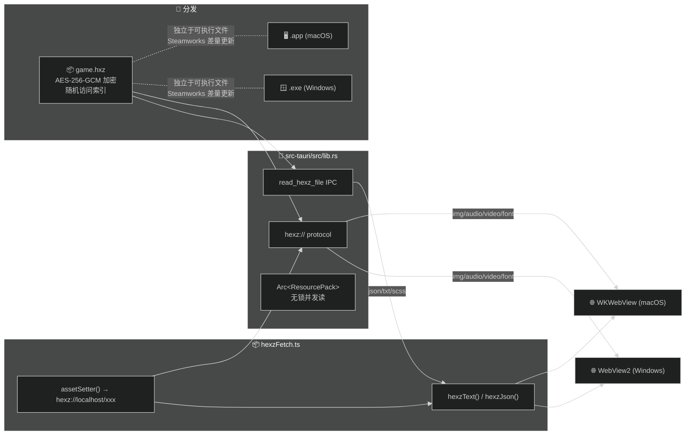

# WebGAL_k

**[English](./README_EN.md)**

基于 [WebGAL](https://github.com/OpenWebGAL/WebGAL) / [Tauri v2](https://v2.tauri.app) / [hexz](https://github.com/maincoretech/hexz_k)，将游戏资源打包为独立 `.hxz` 归档文件，支持 Steamworks 差量更新。

---

## 架构



**双通道设计** — `hexz://` protocol 处理 no-cors 媒体，Tauri IPC 处理文本资源（WKWebView 阻止跨域 XHR）。

| 资源类型 | 通道 | 原因 |
|----------|------|------|
| 图片 / 音频 / 视频 / 字体 | `hexz://` protocol | 浏览器原生，零开销 |
| json / txt / scss | Tauri IPC | WKWebView CORS 限制 |

---

## 与上游 WebGAL 差异

### 资源加载

| 上游 WebGAL | WebGAL_k |
|-------------|----------|
| 资源散落在 `public/game/` 目录 | 打包为单个 `game.hxz` 加密归档 |
| 通过相对路径 `./game/xxx` 加载 | 通过 `hexz://localhost/xxx` 协议加载 |
| 所有请求走浏览器 fetch/XHR | 双通道：no-cors 走 protocol，文本走 IPC |
| 依赖 Service Worker 做缓存/转发 | 无 SW（WKWebView 不支持） |

### 安全性

| 上游 WebGAL | WebGAL_k |
|-------------|----------|
| 资源明文存储在文件系统 | AES-256-GCM 加密 |
| 密码无原生支持 | `HEXZ_PASSWORD` 环境变量解密 |

### 分发与更新

| 上游 WebGAL | WebGAL_k |
|-------------|----------|
| Web 端部署，资源随页面加载 | 桌面端 Tauri 打包 |
| 更新需重新部署全部文件 | `.hxz` 独立于可执行文件，支持 Steamworks 差量更新 |
| 客户端每次请求完整资源 | O(1) 随机访问，按需读取单个文件 |

---

## 构建

```bash
# 1. 打包游戏资源为 .hxz 归档（无加密情况）
# 同样的你可以使用gui工具来做这一步
cargo run --manifest-path hexz_k/Cargo.toml -- pack game/ game.hxz

# 2. 构建桌面应用
bun tauri build

# 3. 部署：game.hxz 放在可执行文件同目录
cp game.hxz src-tauri/target/release/bundle/macos/webgal-k.app/Contents/MacOS/
```

`find_hexz()` 自动搜索 exe 同目录、上级目录、macOS `.app` 同级。

## 许可

MIT · 基于 [WebGAL](https://github.com/OpenWebGAL/WebGAL) 构建

