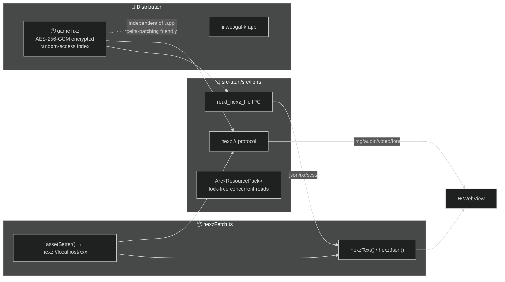

# WebGAL_k

**[中文版](./README.md)**

> WebGAL + hexz = Encrypted · Random-access · Delta-updatable desktop visual novel engine

Built on [WebGAL](https://github.com/OpenWebGAL/WebGAL) / [Tauri v2](https://v2.tauri.app) / [hexz](https://github.com/maincoretech/hexz_k). Packs game assets into a single encrypted `.hxz` archive, fully compatible with Steamworks delta patching.

---

## Architecture



**Dual-channel design** — `hexz://` protocol for no-cors media, Tauri IPC for text resources (WKWebView blocks cross-origin XHR).

| Resource Type | Channel | Reason |
|---------------|---------|--------|
| images / audio / video / fonts | `hexz://` protocol | native browser support, zero overhead |
| json / txt / scss | Tauri IPC | WKWebView CORS restriction |

---

## Differences from Upstream WebGAL

### Asset Loading

| Upstream WebGAL | WebGAL_k |
|-----------------|----------|
| Assets scattered in `public/game/` | Packed into single `game.hxz` encrypted archive |
| Loaded via relative path `./game/xxx` | Loaded via `hexz://localhost/xxx` protocol |
| All requests use browser fetch/XHR | Dual channels: no-cors via protocol, text via IPC |
| Service Worker for caching/relay | No SW (WKWebView incompatible) |

### Security

| Upstream WebGAL | WebGAL_k |
|-----------------|----------|
| Assets stored in plaintext on disk | AES-256-GCM encryption |
| No native password support | `HEXZ_PASSWORD` env var for decryption |

### Distribution & Updates

| Upstream WebGAL | WebGAL_k |
|-----------------|----------|
| Web deployment, assets load with page | Desktop app via Tauri |
| Full redeploy on update | `.hxz` independent of executable, Steamworks delta patch ready |
| Client fetches full resource per request | O(1) random access, single-file reads on demand |

### Concurrency

| Upstream WebGAL | WebGAL_k |
|-----------------|----------|
| Browser-native concurrency | `Arc<ResourcePack>` lock-free, protocol + IPC parallel channels |

### UI Tweaks

- Textbox: removed `backdrop-filter: blur()`, darker background
- Title screen: removed full-screen transparent overlay, fixed double-click SFX

---

## Build

```bash
# 1. Pack game assets into .hxz archive (unencrypted)
# You can also use the GUI tool for this step
cargo run --manifest-path hexz_k/Cargo.toml -- pack game/ game.hxz

# 2. Build desktop app
bun tauri build

# 3. Deploy: place game.hxz alongside the executable
cp game.hxz src-tauri/target/release/bundle/macos/webgal-k.app/Contents/MacOS/
```

`find_hexz()` searches exe directory, parent directory, and macOS `.app` bundle root.

---

## hexz Features in Use

| Feature | Implementation |
|---------|---------------|
| **Encryption** | AES-256-GCM, `HEXZ_PASSWORD` env var |
| **Random access** | O(1) index lookup, per-file reads |
| **Concurrent reads** | `Arc<ResourcePack>`, protocol + IPC in parallel |
| **Delta updates** | `.hxz` independent of executable, Steamworks-ready |

---

## License

MIT · Built on [WebGAL](https://github.com/OpenWebGAL/WebGAL)

